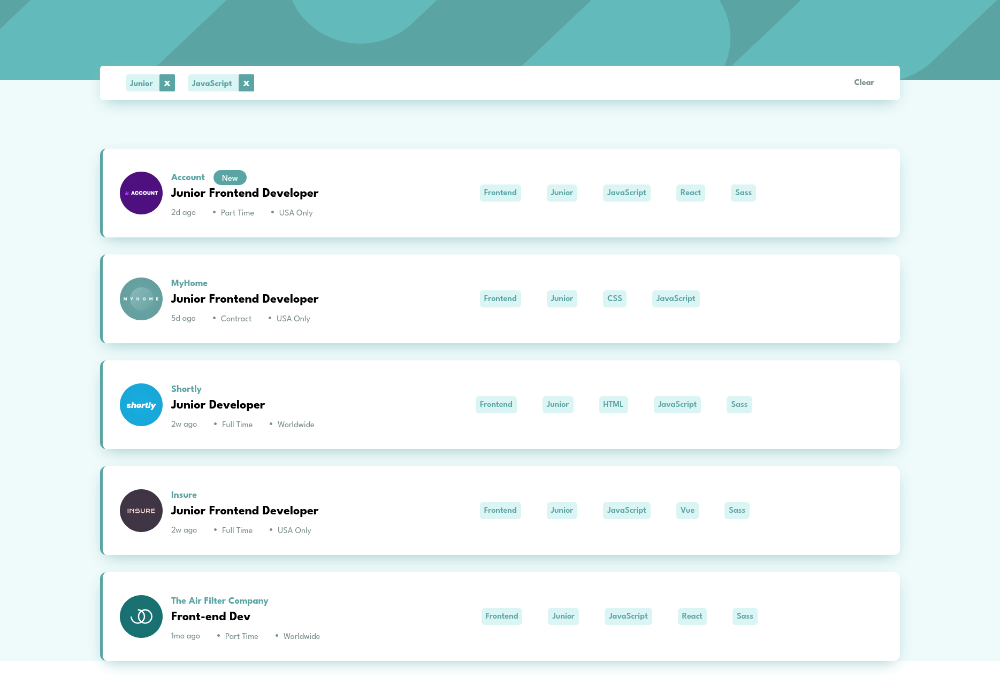

# Frontend Mentor - Job listings with filtering solution

This is a solution to the [Job listings with filtering challenge on Frontend Mentor](https://www.frontendmentor.io/challenges/job-listings-with-filtering-ivstIPCt). Frontend Mentor challenges help you improve your coding skills by building realistic projects.

## Table of contents

- [Overview](#overview)
  - [The challenge](#the-challenge)
  - [Screenshot](#screenshot)
  - [Links](#links)
- [My process](#my-process)
  - [Built with](#built-with)
  - [What I learned](#what-i-learned)
  - [Continued development](#continued-development)
  - [Useful resources](#useful-resources)

## Overview

### The challenge

Users should be able to:

- See hover states for all interactive elements on the page
- Filter job listings based on the categories

### Screenshot



### Links

- Live Site URL: [Live Preview](https://azanra.github.io/static-job-listing/)

## My process

### Built with

- React
- Reducer and Context Hooks

### What I learned

This project focused on using Reducer and Context hooks. Reducer is used to put all of the state setter into one place, instead of scattered everywhere in the component in each event handler. By putting all of it into one place it make it easier to know what happened to the state at one glance.

```js
const [selectedFilter, dispatch] = useReducer(
  selectedFilterReducer,
  initialFilter
);
```

Reducer receive two parameter, first is the reducer function and the initial value of the state. it will return the state and dispatch function.

```js
export function selectedFilterReducer(selectedFilter, action) {
  switch (action.type) {
    case "set":
      if (action.filterType === "languages" || action.filterType === "tools") {
        const updatedFilter = JSON.parse(JSON.stringify(selectedFilter));

        updatedFilter[action.filterType].includes(action.filterValue) ===
          false && updatedFilter[action.filterType].push(action.filterValue);

        return updatedFilter;
      } else {
        return {
          ...selectedFilter,
          [action.filterType]: action.filterValue,
        };
      }
    case "remove":
      if (action.filterType === "languages" || action.filterType === "tools") {
        const updatedFilter = JSON.parse(JSON.stringify(selectedFilter));
        const removedFilter = updatedFilter[action.filterType].filter(
          (item) => {
            return item !== action.filterValue;
          }
        );
        return {
          ...selectedFilter,
          [action.filterType]: removedFilter,
        };
      } else {
        return {
          ...selectedFilter,
          [action.filterType]: null,
        };
      }
    case "reset":
      return initialFilter;
    default:
      throw new Error("Unknown Action Type ", action.type);
  }
}
```

The reducer function receive two parameter, which is the state and action object. the function will check the type in the action object and set the next state to whatever it return.

```js
<button
  onClick={() => {
    dispatch({
      type: "set",
      filterType: type,
      filterValue: value,
    });
  }}
  className="bg-(--Light-Grayish-Cyan) text-(---Desaturated-Dark-Cyan) font-semibold px-2 py-1 cursor-pointer hover:bg-(---Desaturated-Dark-Cyan) hover:text-white rounded-md"
>
  {value}
</button>
```

To set the next state, we will call the dispatch function and provide it with the action object, where it contain the type of the action, and the rest of the action object that was needed to set the next state.

Context hooks is used to pass the data anywhere deep in the tree as long as it in the same tree. instead of passing it as a props (prop drilling)

```js
export const SelectedFilterContext = createContext(null);
export const DispatchContext = createContext(null);
```

We create the context first and provide it initial value, it need to start with the capital

```js
<SelectedFilterContext.Provider value={selectedFilter}>
  <DispatchContext.Provider value={dispatch}>
    {children}
  </DispatchContext.Provider>
</SelectedFilterContext.Provider>
```

To provided value to the context we can create a component provider and provide the value into value attribute

```js
const dispatch = useContext(DispatchContext);
```

To get the value of the context, call the useContext and provide it with which context that we want to get.

### Continued development

- Get more practice with reducer and context
- Start with using ref hooks

### Useful resources

- [React Docs](https://react.dev/learn/scaling-up-with-reducer-and-context)(On explaining reducer and context hooks, and how to use both of them at the same time)
